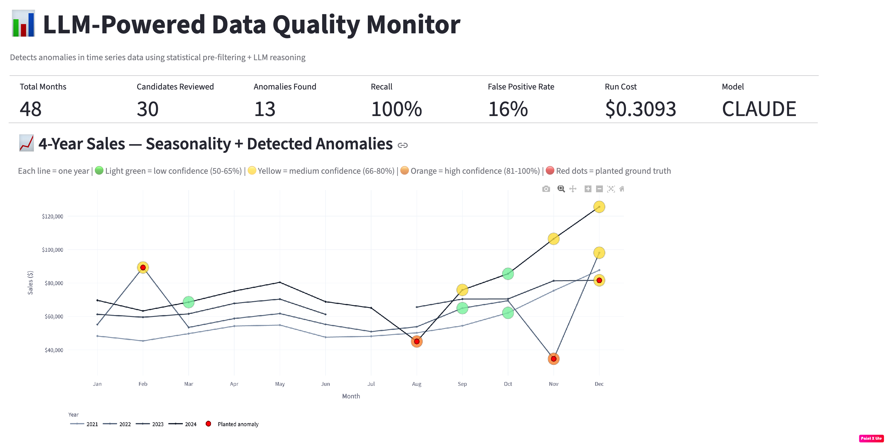

# LLM-Powered Data Quality & Anomaly Detection

> Combining statistical pre-filtering with LLM reasoning to detect anomalies
> in time series data — including semantic anomalies that rule-based systems miss.

---
## Dashboard Preview

---

## Problem Statement

Traditional data quality tools rely on hardcoded rules (e.g. revenue >= 0).
These work well for known issues but fail on unknown ones — gradual drift,
weak seasonal performance, or context-dependent anomalies that only make
sense when you understand the broader trend and seasonality of the data.

This project builds a pipeline that combines:
- Statistical pre-filtering to reduce LLM calls (cost control)
- LLM reasoning to catch anomalies that rules and statistics alone miss
- Human feedback loop to continuously improve detection accuracy over time

---

## Architecture

Raw Time Series Data (48 months)
        down
Statistical Pre-Filter (rolling + seasonal deviation)
        down — filters 48 to 30 candidates (37.5% cost reduction)
LLM Analysis (Claude / Gemini)
        down — few-shot prompted, trajectory-aware
Findings + Severity Rankings
        down
Streamlit Dashboard
        down
Human Feedback Loop — grows few-shot example library — improves future runs

---

## Key Design Decisions and Tradeoffs

### 1. Two-layer detection (statistical + LLM)
Why: Pure statistical methods struggle when trend and seasonality interact.
Tradeoff: Pre-filter introduces recall risk for sub-threshold anomalies.

### 2. Few-shot examples over fine-tuning
Why: Few-shot examples are added in minutes and take effect immediately.
Tradeoff: Prompt length grows with each example, increasing token cost.

### 3. Human feedback loop
Why: No static prompt generalises perfectly to all anomaly types.
Result: One correction dropped false positive rate 20% to 16% at 100% recall.

### 4. Seasonally-aware candidate filter
Why: Prevents Nov/Dec from being auto-flagged in retail data every year.

### 5. Model switcher (Claude + Gemini)
Why: Avoids vendor lock-in, enables A/B testing across providers.

---

## Results

| Metric | Value |
|---|---|
| Dataset | 48 months synthetic retail sales 2021-2024 |
| Planted anomalies | 5 across 4 types |
| Statistical pre-filter | 48 to 30 candidates (37.5% reduction) |
| Final recall | 5/5 (100%) |
| False positive rate | 16% |
| Prompt iterations | 4 |
| Estimated cost per run | approx $0.17 |

### Anomaly types detected

| Type | Caught | Confidence |
|---|---|---|
| sudden_spike | YES | 67% |
| sudden_drop | YES | 96% |
| missing_data | YES | 87% |
| gradual_drift | YES | 67% |
| non_seasonal_dip | YES | 78% |

### Known limitations
- Single-month review cannot catch very slow multi-month drift
- Growth-trend months still generate 16% false positives
- Seasonal baseline unreliable in Year 1-2 due to limited history

---

## Tech Stack

| Layer | Technology |
|---|---|
| Language | Python 3.12 |
| Notebook | Google Colab |
| LLM APIs | Anthropic Claude, Google Gemini |
| Statistical engine | pandas, numpy |
| Dashboard | Streamlit + Plotly |
| Persistent storage | Google Drive |
| Version control | GitHub |

---

## Project Structure

llm-data-quality-monitor/
├── 01_data_profiler.ipynb        Main notebook
├── dashboard.py                  Streamlit dashboard
├── synthetic_sales_48mo.csv      Generated dataset
├── pipeline_results.csv          Latest pipeline results
└── README.md                     This file

---

## How to Run

1. Clone the repo
   git clone https://github.com/YOUR_USERNAME/llm-data-quality-monitor

2. Open notebook in Google Colab

3. Add API keys to Colab Secrets
   ANTHROPIC_API_KEY
   GEMINI_API_KEY
   NGROK_TOKEN
   GITHUB_TOKEN

4. Run all cells in order (Sections A then B then C)

5. Launch dashboard from final cell in Section A

---

## What I Would Build Next

- Trend-window anomaly check for slow multi-month drift
- Multi-dataset support beyond synthetic retail
- Automated feedback scoring across runs
- Cost optimisation via caching unchanged months
- Teams/Slack integration for scheduled findings

---

## Author

Built as a portfolio project demonstrating LLM-powered data engineering patterns.
Interested in discussing the architecture or design decisions?
Feel free to open an issue or connect on LinkedIn.
